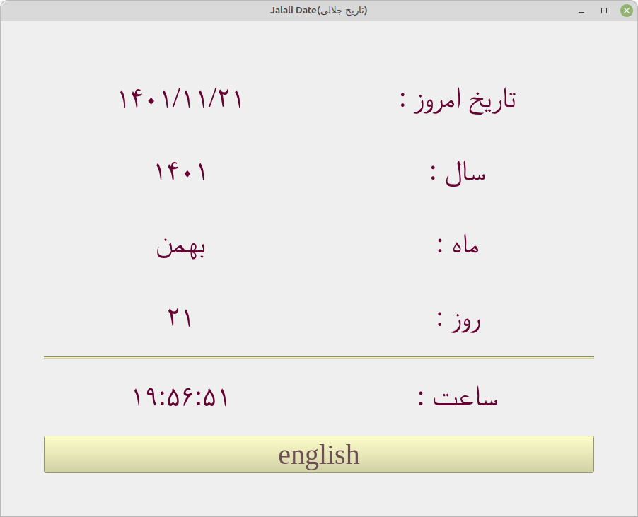
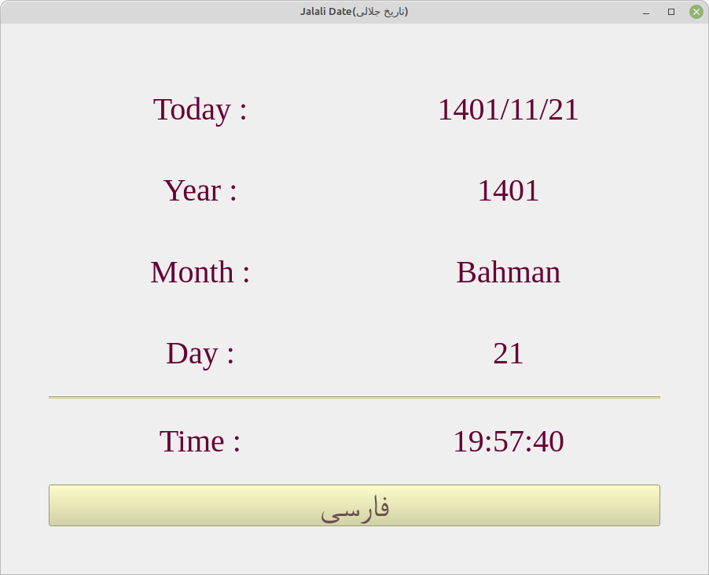

<h2>Goal:</h2>

In some operating systems, there is no persian calender, so in this   
repository a graphical app has been created to show current jalali  
date and time(persian date and time).

<h2>Packages:</h2>

1-jdatetime: to get jalali date and time.  
2-pyside6: to create a gui(based on QT6).  
3-convert_numbers: to convert english numbers to persian.  
4-pyinstaller: to create an executable app in your OS (that's up to you)  
and if you don't need this package, just remove it from  
"requirements.txt" file before install the packages.  

<h2>How to run?</h2>

1-install python3 (at the moment Im using version 3.10) and pip.

2-install the packages named in file "requirements.txt":

<h4>command line: pip3 install -r requirements.txt</h4>	

3- run the "execute.py" file.

<h2>Application environment:</h2>

